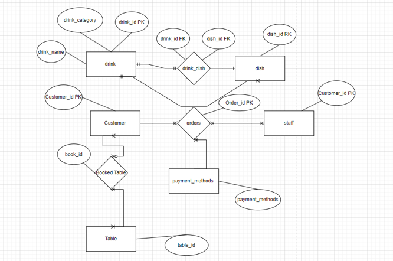

# Restaurant Database Management System

## Project Overview

This project is a database system designed to automate key processes of restaurant operations.
The system was developed as a course project for the **Databases** discipline.

The main goal of the project was to design and implement a relational database for managing restaurant data, including customers, orders, online orders, menu items, staff, table reservations, and payment methods.

The database was implemented using **Microsoft SQL Server 2022**.

## Business Problem

Restaurants handle many operational processes daily, such as customer management, order processing, table reservations, menu management, staff information, and payment tracking.

Manual handling of this information can lead to errors, delays, and inefficient service.
This project addresses the problem by creating a structured database that supports restaurant workflow automation and enables basic purchase analytics.

## Project Objectives

* Design a logical and physical database model for restaurant operations.
* Create an ER diagram to represent entities and relationships.
* Normalize the database structure up to the third normal form.
* Implement database tables with primary keys, foreign keys, and constraints.
* Create views, indexes, triggers, and stored procedures.
* Write SQL queries for data analysis and reporting.

## Database Design

The database includes the following main entities:

* Customers
* Tables
* Booked Tables
* Dish
* Drink
* Drink-Dish
* Staff
* Payment Methods
* Orders
* Online Orders

The database structure was normalized to reduce data redundancy and improve data integrity.

## ER Diagram

Add the ER diagram here:

## Database Schema

Add the database schema screenshot here:

## Key Features

### Database Tables

The project includes SQL scripts for creating relational tables with:

* Primary keys
* Foreign keys
* NOT NULL constraints
* DEFAULT constraints
* Referential integrity

### View

A view called `OrderDetails` was created to combine information from regular orders and online orders.

The view provides information about:

* Order ID
* Customer name
* Staff name
* Bill amount
* Payment method
* Item name
* Item price
* Item type

### Indexes

Indexes were created to improve query performance for frequently used columns, including:

* Customer ID
* Payment ID

### Trigger

A trigger was created to automatically update the total bill amount after inserting or updating order records.

### Stored Procedures

Stored procedures were implemented for:

* Displaying menu information
* Sales analytics for regular orders
* Sales analytics for online orders

### Analytical Queries

The project also includes SQL queries using:

* Subqueries
* JOIN operations
* CROSS JOIN
* Aggregation
* Filtering
* Grouping

## Example Queries

The project contains queries for:

* Finding customers who made online orders
* Getting staff members who handled orders from a specific customer
* Finding customers with an average bill higher than the overall average
* Finding customers with total bill amounts higher than the maximum single bill
* Generating all possible combinations of dishes and drinks
* Generating all possible combinations of staff members and tables

## Technologies Used

* Microsoft SQL Server 2022
* SQL Server Management Studio
* T-SQL
* Relational Database Design
* ER Modeling
* Database Normalization

## Skills Demonstrated

* Relational database design
* SQL database development
* ER diagram creation
* Database normalization
* Primary and foreign key design
* SQL views
* Index creation
* Triggers
* Stored procedures
* Subqueries
* CROSS JOIN
* Basic database analytics

## Conclusion

This project demonstrates the design and implementation of a relational database system for restaurant workflow automation.

The database supports customer management, order processing, online orders, staff management, payment tracking, table reservations, and basic sales analytics.
